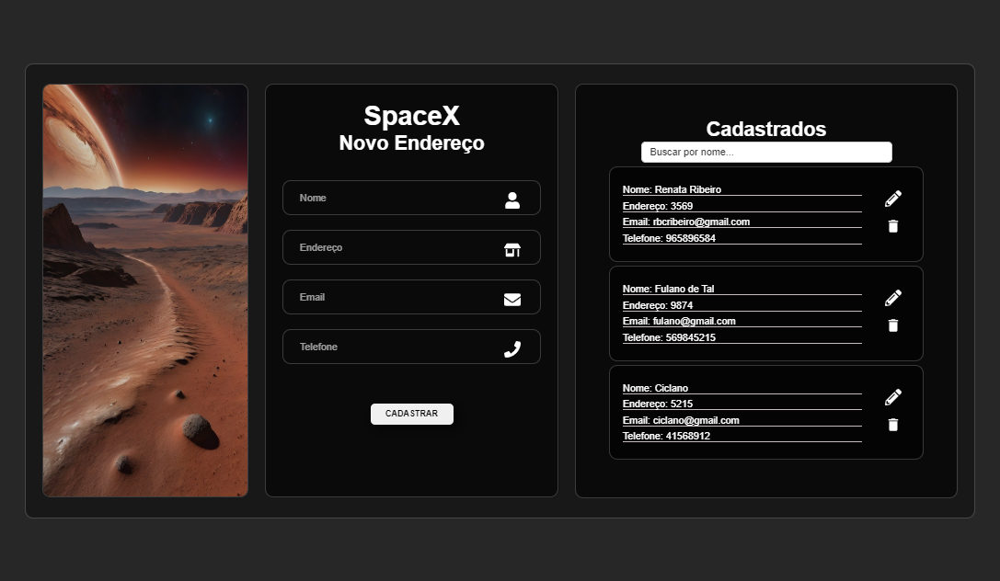
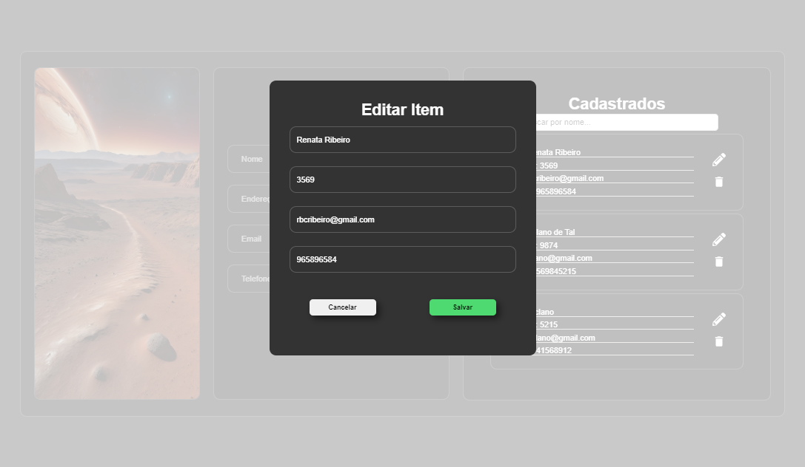
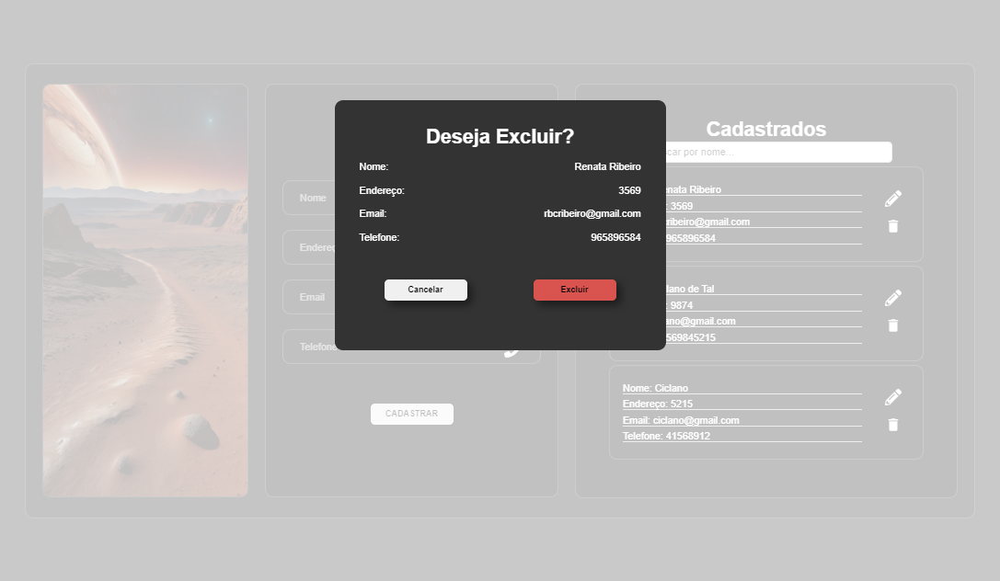
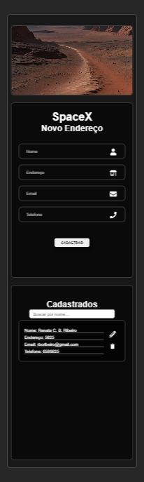
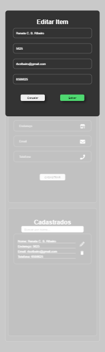
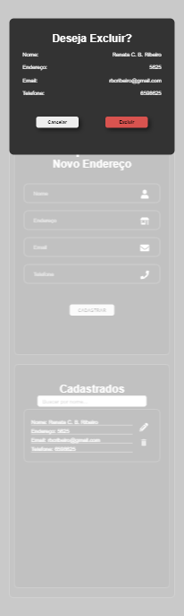

# Desafio: Sistema de Delivery Interplanetário

Este projeto é uma aplicação desenvolvida com React que simula um sistema de delivery interplanetário, permitindo o cadastro, edição e visualização de endereços entre a Terra e Marte.

## Enunciado do Desafio

Você foi selecionado para construir um sistema de delivery interplanetário! Com a expansão da SpaceX na década de 2050 e o barateamento dos custos, a humanidade passou a exportar grande parte da produção e estoques de dispositivos eletrônicos para Marte. Por isso, você está criando um sistema de delivery entre planetas, que automatize esse processo de entrega de Marte para a Terra e vice-versa. Saiba que, diferentemente da Terra, em Marte não existem países ou cidades, apenas lotes de quatro dígitos que representam a localização de cada fábrica ou local de armazenamento. Usando React, você deve desenvolver duas páginas: as páginas de cadastro e edição de endereço.

## Funcionalidades

- **Página Inicial**: Apresenta uma visão geral do sistema de delivery interplanetário.
- **Cadastro de Endereço**: Permite ao usuário cadastrar novos endereços, incluindo nome e endereço.
- **Visualização de Endereços**: Exibe todos os endereços em Marte, que são formados apenas por 4 digitos numéricos.
- **Edição de Endereços**: Oferece a opção de editar endereços já cadastrados.
- **Busca por Nome**: Permite ao usuário fazer uma busca pelo nome do destinatário.

## 🎯 [Visite o Site](https://rbcribeiro.github.io/tela_cadastrar_editar/) 

&nbsp;

## RENATA RIBEIRO

  

  

  

